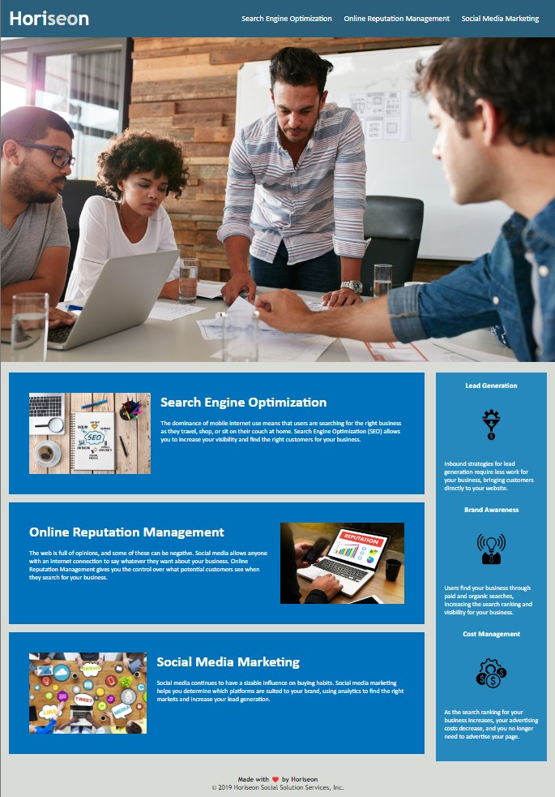

# Module 01 Challenge

## Mock Up



This is my completed code for the Module 01 challenge this week. We were given a task this week in the form of an on-the-job ticket, where we need to modify a starter code to meet Acceptance Criteria. The user story was:

## User Story

```
AS A marketing agency
I WANT a codebase that follows accessibility standards
SO THAT our own site is optimized for search engines
```

The Acceptance Criteria is as follows:

## Acceptance Criteria

```
GIVEN a webpage meets accessibility standards
WHEN I view the source code
THEN I find semantic HTML elements
WHEN I view the structure of the HTML elements
THEN I find that the elements follow a logical structure independent of styling and positioning
WHEN I view the icon and image elements
THEN I find accessible alt attributes
WHEN I view the heading attributes
THEN they fall in sequential order
WHEN I view the title element
THEN I find a concise, descriptive title
```

What I ended up doing to complete this challenge is tackle each individual criteria one at a time, while also trying to clean up the code as much as I can. I first started adding semantic HTML elements header, nav, section, aside, and footer. 

I then went on to reviewing the structure of the HTML elements, to make sure they follow the logical structure from header down to footer. 

After making the necessary adjustments to structure, I then went on to add alt attributes to all the image elements, describing what the selected image looks like.

Once I was done adding the alt attributes to the images, I then started checking the heading attributes throughout the code and put them in sequential order, from h1 the header, to h2 in the section, h3 in the aside, and h4 at the footer.

As the last criteria, I added a title element with the marketing agency's full name as the title.
